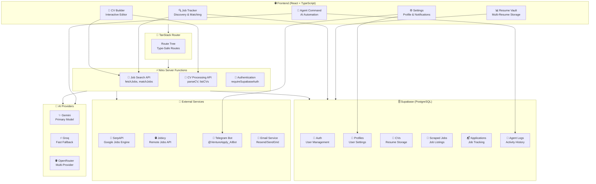
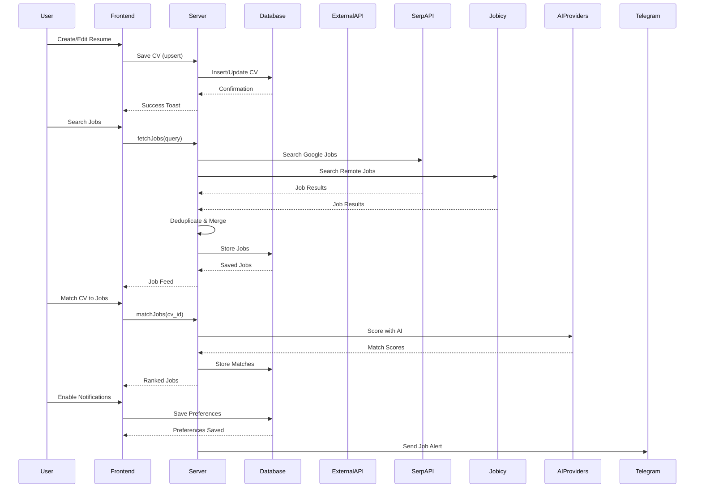

# VentureApply AI

An AI-powered job application platform that helps you build professional resumes, discover opportunities across multiple job boards, and streamline your application workflow.

## Architecture Overview



## Data Flow



## Features

### 🎨 CV Builder
- **Interactive Resume Editor** - Create and customize professional resumes with live preview
- **Multiple Templates** - Choose from Minimalist, Creative, and Executive styles
- **Inline Renaming** - Real-time resume naming with auto-save (500ms debounce)
- **File Import** - Upload PDF or TXT files and let AI structure your CV
- **PDF Export** - Export polished resumes with iframe-based rendering (no CSS inheritance issues)

### 🔍 Job Discovery & Tracking
- **Dual Job Search** - Searches both SerpAPI (Google Jobs) and Jobicy in parallel
- **Smart Deduplication** - Removes duplicate listings across sources
- **Location Filtering** - Filter by Remote, Hybrid, On-site, or Any location
- **Live Feed** - Always see results immediately, even for previously searched keywords
- **Job Matching** - Score your CV against discovered jobs

### 📊 Resume Vault
- **Multi-Resume Management** - Store and manage multiple resume versions
- **Template Preview** - Preview any resume with different templates
- **Quick Export** - Export any saved resume to PDF instantly

### ⚙️ Settings & Notifications
- **Profile Management** - Editable personal information (name, phone, title, summary, location)
- **Multi-Channel Notifications** - Email, Telegram, and WhatsApp alerts
- **Telegram Bot Integration** - Get job alerts via @VentureApply_AIBot

### 🤖 Agent Command
- **AI Agent** - Automated job application assistance

## Tech Stack

| Layer | Technology |
|-------|------------|
| **Frontend** | React, TypeScript, TanStack Router |
| **Backend** | Nitro/Start Server Functions |
| **Database** | Supabase (PostgreSQL) |
| **AI/ML** | Google Gemini, Groq, OpenRouter (fallback) |
| **Job APIs** | SerpAPI, Jobicy |
| **UI** | shadcn/ui, Tailwind CSS, Lucide Icons |
| **Notifications** | Telegram Bot API |

## Getting Started

### Prerequisites

- Node.js 18+
- npm or pnpm
- Supabase account
- API keys (see below)

### Environment Variables

Create a `.env` file in the root directory:

```env
# Supabase
PUBLIC_SUPABASE_URL=your_supabase_url
PUBLIC_SUPABASE_ANON_KEY=your_supabase_anon_key
SUPABASE_SERVICE_ROLE_KEY=your_service_role_key

# AI Providers (at least one required)
GEMINI_API_KEY=your_gemini_api_key
GROQ_API_KEY=your_groq_api_key
OPENROUTER_API_KEY=your_openrouter_api_key

# Job Discovery
SERPAPI_KEY=your_serpapi_key
```

### Installation

```bash
# Clone the repository
git clone https://github.com/BetelAddisu/ventureapply-ai.git
cd ventureapply-ai

# Install dependencies
npm install

# Run development server
npm run dev
```

### Database Setup

Run the Supabase migrations to set up the required tables:

```bash
# Apply migrations (using Supabase CLI or manual SQL execution)
supabase db push
```

### Build for Production

```bash
npm run build
npm run start
```

## Project Structure

```
ventureapply-ai/
├── src/
│   ├── components/          # Reusable UI components
│   │   ├── app-sidebar.tsx  # Main navigation sidebar
│   │   └── cv-templates/     # Resume template renderers
│   ├── hooks/               # Custom React hooks
│   │   └── use-cv-cache.ts  # CV data caching
│   ├── integrations/        # Third-party integrations
│   │   └── supabase/       # Supabase client & auth
│   ├── lib/                 # Core utilities & server functions
│   │   ├── jobs.functions.ts    # Job search & matching
│   │   ├── cv.functions.ts      # CV parsing & listing
│   │   ├── cv-extract.functions.ts # Profile extraction
│   │   └── notification.functions.ts # Multi-channel notifications
│   └── routes/              # Page routes
│       └── _authenticated/  # Protected dashboard routes
│           ├── dashboard.tsx        # Main dashboard
│           ├── dashboard.cv-builder.tsx  # CV Builder
│           ├── dashboard.jobs.tsx   # Job Tracker
│           ├── dashboard.settings.tsx    # Settings
│           └── dashboard.resumes.tsx     # Resume Vault
├── supabase/
│   └── migrations/          # Database migrations
└── public/                  # Static assets
```

## API Reference

### Job Search (`/api/search`)
Fetches jobs from SerpAPI and Jobicy, merges results, and stores in database.

**Request:**
```typescript
{
  target_role?: string;      // Job search keyword
  location_type?: "any" | "remote" | "hybrid" | "onsite";
}
```

**Response:**
```typescript
{
  inserted: number;          // Number of new jobs saved
  total_found: number;       // Total jobs found
  message: string;           // Human-readable status
  used_cv_fallback: boolean; // Whether CV profile was used
}
```

### CV Parsing (`/api/parse-cv`)
Extracts structured CV data from raw text using AI.

### Notifications
Multi-channel notification system supporting:
- Email (via Resend/SendGrid)
- Telegram (via @VentureApply_AIBot)
- WhatsApp

## Contributing

1. Fork the repository
2. Create a feature branch (`git checkout -b feature/amazing-feature`)
3. Commit your changes (`git commit -m 'Add amazing feature'`)
4. Push to the branch (`git push origin feature/amazing-feature`)
5. Open a Pull Request

## License

This project is private and proprietary.

## Acknowledgments

- [TanStack](https://tanstack.com/) - Routing and data management
- [Supabase](https://supabase.com/) - Database and authentication
- [shadcn/ui](https://ui.shadcn.com/) - Beautiful UI components
- [SerpAPI](https://serpapi.com/) - Google Jobs data
- [Jobicy](https://jobicy.com/) - Remote job listings
